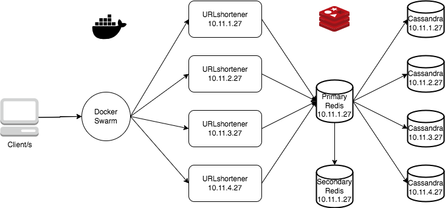

# URLShortener

This service was made to demontrate how to handle horizontal and vertical scaling of a simple python application hosted from docker. The application will shorten URLs for the user and store them onto a persistent storage solution handled by Cassandra's PostgreSQL cluster of nodes. This app is designed to take a high load of requests which may increase the time it takes to get a response from Cassandra. In order to mitigate response time, there is a redis cache which the app will contact before requesting from Cassandra. 

Please see below for the full architecture diagram & further explanation. 

## Orchestration:

START SERVICE: ./orchestrate.sh start 
STOP SERVICE: ./orchestrate.sh stop
Hosts can be found in the ‘hosts’ file. In order to fully demo this application, you will need to have a collection of VMs to connect to and run the different nodes as to simulate persistent availability of the system in case of a failure. Edit the above sh files accordingly to your system. 

## Design:

I have created a docker swarm with a Cassandra cluster ran outside of the swarm. The docker swarm contains a URLshortener application created in Flask/Python, a simple cache in Redis and a monitor made using Prometheus.
Application: URLshortener
The URLshortener will handle get and put requests and try to safety return to the user. I decided to use Flask python for this application because Flask applications are multithreaded by default, meaning that every new request is handled by a different thread. I felt that a Java application would have been more complicated in terms of multithreading.

### Cache: Redis
Whenever a GET request is issued, the application will first look for the operation in the primary Redis node before checking Cassandra’s persistent data storage. If the operation is found in the cache, then we return the value and to save compute, we do not check the value in Cassandra. If the operation is not in cache but can be found in Cassandra, then we insert the operation into the Redis cache before returning. For PUT requests, the operation is only cached into Redis if there already is a short registered because the long value will need to be replaced. There is only one secondary alongside the primary node as I couldn’t see the benefit of having multiple read only caches when we have Cassandra for persistent storage. The secondary’s configuration is supplied from docker (Inside the run command). The primary will dump its cache into the
secondary after 50mb of storage is filled and implements a LRU policy that appends its data to disk.

### Persistence: Cassandra
When a GET request is issued, the application will query Cassandra in the case that the short is not stored in the cache. When a PUT request is issued and the operation is valid, the operation will be stored into Cassandra. My Cassandra implementation includes one Cassandra node per host (default = 4) and a replication factor of 2 with a simpleStrategy replication. I believe this is a reasonable amount of replication as every row exists in two different Cassandra nodes which will exist on different systems. Having a low replication factor will generally benefit PUT requests more than GET requests since there are less places to replicate for each PUT.
